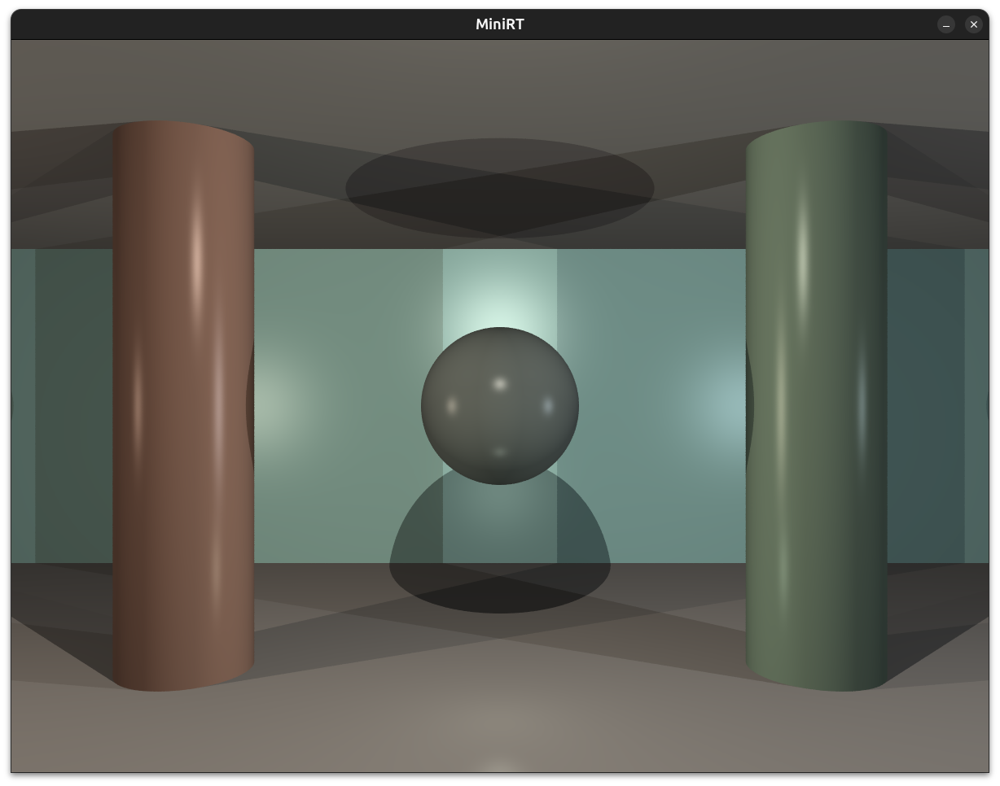

# MiniRT

A ray tracing project implementing the Phong illumination model in C.



## Description

MiniRT is a simple ray tracer that renders 3D scenes with basic geometric shapes (spheres, planes, cylinders) and lighting effects. It uses the Phong reflection model to calculate ambient, diffuse, and specular lighting.

## Features

- Ray tracing with Phong illumination model
- Support for spheres, planes, and cylinders
- Ambient, diffuse, and specular lighting
- Shadow calculation
- Scene parsing from .rt files
- Real-time rendering with MiniLibX

## Requirements

- Linux environment
- clang compiler
- MiniLibX library (automatically downloaded and configured by Makefile)

## Installation

1. Clone the repository:
   ```bash
   git clone https://github.com/IvanMiao/MiniRT.git
   cd MiniRT
   ```

2. Build the project:
   ```bash
   make
   ```
   This will automatically download and configure the MiniLibX library if not present.

## Usage

Run the program with a scene file:

```bash
./miniRT scenes/scene_file.rt
```

### Scene Files

Scene files are located in the `scenes/` directory. Examples:
- `scenes/01basic.rt` - Basic scene with a sphere
- `scenes/morandi.rt` - More complex scene
- `scenes/multi_objects.rt` - Multiple objects

Scene files define:
- Camera position and orientation (C)
- Ambient light (A)
- Light sources (L)
- Objects: spheres (sp), planes (pl), cylinders (cy)

## Bonus Features

The bonus version includes additional features:
- Cones (cn)
- Multiple lights
- Enhanced lighting effects

To build and run the bonus version:

```bash
make bonus
./bonus/miniRT_bonus bonus/bonus_scenes/scene_file.rt
```

## Project Structure

```
├── src/                    # Main source code
│   ├── math_tool/         # Vector and color math utilities
│   ├── objects/           # Geometric object definitions and hit calculations
│   ├── parsing/           # Scene file parsing
│   ├── render/            # Ray tracing and rendering logic
│   ├── event/             # Event handling
│   └── utils/             # Utility functions
├── bonus/                 # Bonus features source code
├── scenes/                # Example scene files
├── docs/                  # Documentation
└── mlx_linux/             # MiniLibX library (auto-downloaded)
```

## Cleaning

- `make clean` - Remove object files
- `make fclean` - Remove object files and executable
- `make re` - Rebuild everything

## Error Handling

The program includes error checking for:
- Invalid scene file format
- Missing required elements (camera, ambient light)
- Incorrect object parameters
- File reading errors

Error scenes are provided in `scenes/error_scenes/` for testing.
