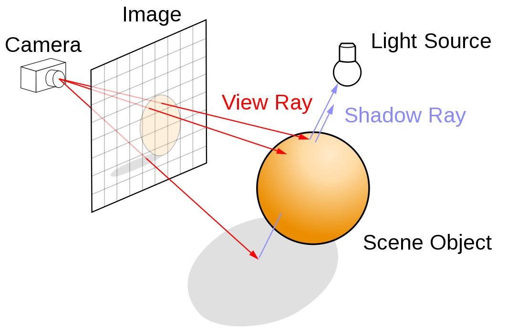

# MiniRT
Ray tracing project

## Architecture

```bash
├── bonus
│   ├── bonus_scenes
│   └── src
│       ├── event
│       ├── math_tool
│       ├── objects
│       ├── parsing
│       ├── render
│       └── utils
├── docs
├── scenes
│   └── error_scenes
└── src
    ├── event
    ├── math_tool
    ├── objects
    ├── parsing
    ├── render
    └── utils
```

## Phases

1.  Parsing
2.  Initialize MLX, initialize events
3.  Setup scene
4.  Main loop: Calculate ray (camera -> ray)
5.  Main loop: Calculate hit points
6.  Main loop: Calculate lighting (ambient color + diffuse color)
7.  Main loop: Put pixel




## Math

### Vector

-   **Vector Subtraction** `vector_sub(A, B)`: Gets a new vector pointing from the endpoint of B to the endpoint of A (A - B).
-   **Vector Dot Product** `vector_dot(A, B)`: The product of two vectors, resulting in a scalar. It measures the similarity in direction between two vectors. The geometric meaning of the dot product is: `A · B = |A| * |B| * cos(theta)`.
    -   If two vectors are perpendicular, their dot product is 0.
    -   If two vectors are unit vectors, their dot product is the cosine of the angle between them.
    -   The dot product of a vector A with itself is equal to the square of its length: |A|^2 = A · A.
-   **Vector Normalization** `vector_normalize(A)`: Changes a vector's length to 1 while keeping its direction unchanged, i.e., making it a unit vector. The calculation is: v / |v|. Unit vectors are very commonly used in ray tracing, for example, to represent ray directions or surface normals.

### Ray

A ray can be precisely described by an origin and a direction. Any point P on the ray can be represented by a parameter t.

`P(t) = O + t * D`

-   `P(t)`: The position vector of a point on the ray that is t units away from the origin.
-   `O`: The origin of the ray, a position vector.
-   `D`: The direction of the ray, a unit vector.
-   `t`: A scalar representing the "distance" or "time" moved from the origin O along the direction D. When t > 0, the point P(t) is in front of the ray's origin. When t=0, P(0) = O, which is the origin of the ray.

### Sphere

A sphere can be defined by a center and a radius. All points P on the surface of the sphere satisfy the condition that the distance from the point to the center is exactly equal to the radius.

`| P - C |^2 = r^2` or `| P - C | = r`

-   `P`: Any point on the surface of the sphere.
-   `C`: The position vector of the sphere's center.
-   `r`: The radius of the sphere.

Using the property of the vector dot product, v · v = |v|^2, the sphere equation can be written as:
`(P - C) · (P - C) = r^2`

#### sphere hit func `hit_sphere()`

Determines if a given ray intersects with a given sphere. If it does, find the closest intersection point.

Mathematical derivation:
1.  If an intersection point P between the ray and the sphere exists, then P must satisfy both the ray equation and the sphere equation.
    -   P = O + t * D
    -   (P - C) · (P - C) = r^2

2.  Substitute the ray equation into the sphere equation: `((O + t*D) - C) · ((O + t*D) - C) = r^2`

3.  Simplify the equation. Let `oc = O - C`, where `oc` is the vector from the sphere's center C to the ray's origin O. The equation becomes: `(oc + t*D) · (oc + t*D) = r^2`

4.  Expand the left side using the distributive property of the dot product: `(oc · oc) + 2 * (oc · (t*D)) + ((t*D) · (t*D)) = r^2`

5.  Since t is a scalar, it can be factored out: `(oc · oc) + 2t * (oc · D) + t^2 * (D · D) = r^2`

6.  Move r^2 to the left side to form a quadratic equation: `(D · D) * t^2 + (2 * (oc · D)) * t + (oc · oc - r^2) = 0`

7.  The three coefficients A, B, and C of this quadratic equation are:
    -   A = D · D
    -   B = 2 * (oc · D)
    -   C = oc · oc - r^2

8.  Use the quadratic formula to solve this equation and find the value(s) of t where the ray intersects the sphere: `t = (-B ± sqrt(B^2 - 4AC)) / (2A)`

Parameters:
-   `oc = vector_sub(ray->origin, sp->center)`: Vector from the sphere's center to the ray's origin (O - C).
-   `a = vector_dot(ray->direction, ray->direction)`: A = D · D
-   `b = 2.0 * vector_dot(oc, ray->direction)`: B = 2 * (oc · D)
-   `c = vector_dot(oc, oc) - sp->radius * sp->radius`: C = oc · oc - r^2
-   `discriminant = b * b - 4 * a * c`

#### sphere normal func `sphere_normal_at`

Given a point p on a sphere, calculate the normal vector at that point. Get the normal of the sphere at a certain point.

A normal vector is a unit vector that is perpendicular to the surface and points outwards. It is crucial in lighting calculations because it determines how light reflects off the surface.

For any point p on a sphere, its normal vector is the vector pointing from the center C to that point p. It can be obtained through vector subtraction:

Normal = p - C

In computer graphics, normal vectors are required to be unit vectors, which greatly simplifies subsequent calculations.

### Cylinder

A finite-height cylinder in 3D space can be defined by the following parameters:

-   **Base Center (Center)**: We usually define this as the center of the bottom circular disk, denoted as C.
-   **Axis Vector (Normal/Axis)**: A unit vector pointing from the base center C to the top center, denoted as V. This vector defines the cylinder's orientation and central axis.
-   **Radius**: The radius of the cylinder, denoted as r.
-   **Height**: The height of the cylinder, denoted as h.

The side surface of a cylinder is the set of all points whose perpendicular distance to the central axis is equal to the radius r.

Imagine any point P in space. We want to know if it lies on the side of an infinitely long cylinder.

1.  There is a vector from the cylinder's base center `C` to the point `P`, `oc = P - C`.
2.  This vector `oc` can be decomposed into two mutually perpendicular components:
    *   A component **parallel** to the axis `V`.
    *   A component **perpendicular** to the axis `V`.
3.  The length of this perpendicular component is the perpendicular distance from point `P` to the central axis.
4.  Using vector projection, the projection of `oc` onto the axis `V` is the vector `(oc · V) * V`.
5.  By vector subtraction, subtracting the parallel component from `oc` leaves the perpendicular component: `oc_perp = oc - (oc · V) * V`.
6.  The condition for point `P` to be on the cylinder's side is that the length of this perpendicular component equals the radius `r`, i.e., `|oc_perp| = r`.
7.  To avoid square roots, we use the squared form: `|oc_perp|^2 = r^2`, which is `|oc - (oc · V) * V|^2 = r^2`.

According to the Pythagorean theorem for vectors, `|a|^2 = |a_parallel|^2 + |a_perp|^2`, the above equation can be simplified to:

`|oc_perp|^2 = |oc|^2 - |oc_parallel|^2`

`|oc_perp|^2 = (oc · oc) - ((oc · V) * V · (oc · V) * V)`

Since `V` is a unit vector, `V · V = 1`, therefore:

`|oc_perp|^2 = (oc · oc) - (oc · V)^2`

So, the equation for the side of an infinite cylinder is: **(P - C) · (P - C) - ((P - C) · V)^2 = r^2**

#### cylinder hit func `hit_cylinder`

1.  Calculate the intersection points of the ray with the **side of the infinite cylinder**.
2.  Calculate the intersection points of the ray with the **two top/bottom caps**.
3.  Among all valid intersection points, find the one closest to the ray's origin.

Substitute the ray equation `P(t) = O + t*D` into the infinite cylinder equation derived above:

`P - C = (O + t*D) - C`

Let `oc_ray` be the vector from the cylinder's base center to the ray's origin, so `oc_ray = O - C`.

Substitute into the equation:

`((oc_ray + t*D) · (oc_ray + t*D)) - ((oc_ray + t*D) · V)^2 - r^2 = 0`

This is another quadratic equation in terms of `t`. The three coefficients are:

-   A: `A = (D · D) - (D · V)^2`
-   B: `B = 2 * ((D · oc_ray) - (D · V) * (oc_ray · V))`
-   C: `C = (oc_ray · oc_ray) - (oc_ray · V)^2 - r^2`

After solving the quadratic equation for `t`, a check against the two caps must be performed:

1.  Calculate the intersection point `P = O + t * D`.
2.  Calculate the vector from the cylinder's base center `C` to the intersection point `P`, `CP = P - C`.
3.  Project `CP` onto the cylinder's axis `V` to get the projected length `m = CP · V`.
4.  Check if this length is within the cylinder's height range, i.e., `0 <= m <= h`. If not, the intersection point is on the side of the infinite cylinder but not on our finite cylinder, and should be discarded.

**Top/Bottom Caps**: Separately calculate the intersection of the ray with the cylinder's top and bottom circular caps.

1.  Each cap is a **plane**. The bottom cap plane is defined by: point `C`, normal `-V`. The top cap plane is defined by: point `C_top = C + h*V`, normal `V`.
2.  Calculate the intersection `t_cap` of the ray with these two planes.
3.  After finding an intersection point, you need to determine if it is **inside** the circular disk. Calculate the distance `d` from the intersection point `P_cap` to the corresponding cap's center. If `d <= radius`, the intersection is valid.
4.  Finally, compare the `t` values of all valid intersections (from the side and the two caps) and take the smallest positive `t` as the final result.

#### cylinder normal func `cylinder_normal_at`

The normal calculation is divided into three cases:
-   **Intersection on the side**: `m = (P - C) · V`, `Normal = normalize(P - C - m*V)`. The geometric meaning of this formula is the perpendicular vector pointing from the central axis to the intersection point.
-   **Intersection on the top cap**: If the intersection is on the top cap, the normal is `V`.
-   **Intersection on the bottom cap**: If the intersection is on the bottom cap, the normal is `-V`.

### cone
The assumed format for a cone is: `cone <center> <normal> <height> <angle> <color>`

### func `setup_cam_coords`

Camera positioning, orientation, and lens selection.

**Problem**: Establishing the Virtual Camera — how to accurately cast rays from a mathematical point (the camera position) towards a 2D pixel grid (the screen).

This function establishes a **local coordinate system** for the virtual camera and defines its View Frustum.

Establish a coordinate system centered on the camera. In this system, we always know the camera's right, up, and back directions (the `u, v, w` basis vectors of the camera's local coordinate system).

1.  Set the aspect ratio.
2.  Define the "world's" up direction, `world_up`, assumed to be the positive Y-axis, used to determine the camera's right and up.
3.  Calculate the camera's back vector, `w`: By convention in computer graphics, the camera "looks" along the -Z axis of its local coordinate system. Therefore, its back vector is the negation of the camera's viewing direction.
4.  Calculate the camera's right vector, `u`: Using the vector cross product, according to the right-hand rule, `(world up) × (camera back)` gives the camera's right vector, which is perpendicular to both `world_up` and `w`.
5.  Calculate the camera's up vector, `v`: Using the cross product again, `(back) × (right)` will yield the vector `v` pointing to the camera's "true up".
6.  The FOV is the camera's "lens," determining the field of view's width. Assume there is a virtual image plane in front of the camera. Using trigonometry, `tan(half_FOV_angle) = (half_image_plane_height) / (distance_to_plane)`. Assuming the image plane is 1 unit away from the camera, `half_height` is simply `tan(theta / 2.0)`.
7.  Calculate `half_width` based on the aspect ratio.

### func `gen_cam_ray`

For each pixel (x, y) on the screen, cast a unique ray. This ray originates from the camera's origin and passes through the corresponding point for that pixel on the virtual image plane.

```c
screen_x = (2.0 * (x + 0.5) / WIDTH - 1.0) * camera->half_width;
screen_y = -(2.0 * (y + 0.5) / HEIGHT - 1.0) * camera->half_height;
```
1.  Map pixel coordinates (x, y) to virtual image plane coordinates:
    -   The range of pixel coordinate x is [0, WIDTH-1].
    -   `(x + 0.5)` is used to make the ray pass through the center of the pixel, not its top-left corner.
    -   `(x + 0.5) / WIDTH` normalizes it to the [0, 1] range.
    -   `2.0 * ... - 1.0` maps it to the standard range of [-1, 1].
    -   Multiplying by `half_width`/`half_height` scales it to the actual size of the virtual image plane (determined by the FOV).
    -   The negative sign before `screen_y` is because screen coordinates typically have y increasing downwards, while our 3D world coordinates have y increasing upwards.

```c
t_vector	screen_point;

screen_point = camera->viewpoint;
screen_point = vector_add(screen_point, vector_mult(camera->u, screen_x));
screen_point = vector_add(screen_point, vector_mult(camera->v, screen_y));
screen_point = vector_add(screen_point, vector_mult(camera->w, -1.0));
```

2.  Calculate the exact position of this point in world coordinates (`screen_point`):
    -   Start from the camera's position (`viewpoint`).
    -   Move `screen_x` units along the camera's "right" vector (`u`).
    -   Then move `screen_y` units along the camera's "up" vector (`v`).
    -   Finally, move 1 unit along the camera's "forward" direction (which is -1 units along the "back" vector `w`). This positions us at the precise point on the virtual image plane.

```c
ray.origin = camera->viewpoint;
ray.direction = vector_sub(screen_point, camera->viewpoint);
ray.direction = vector_normalize(ray.direction);
```

3.  Generate the final ray:
    -   The ray's `origin` is the camera's position.
    -   The ray's `direction` is the vector from the origin to the `screen_point` we just calculated.
    -   Finally, normalize the direction vector.

### func `is_in_shadow`

Calculates shadows: determines if a point is in shadow.

From a point on an object's surface, `hit_point`, a new ray (called a **shadow ray**) is cast towards the light source `light_pos`. If this ray hits **any other object** in the scene before reaching the light source, then `hit_point` is obstructed and is in shadow.

1.  Construct a "shadow ray" from the object's surface towards the light source, and set a maximum effective distance (the distance to the light).
2.  Iterate through all objects in the scene.
3.  For each object, call `hit_for_shadow`.
4.  `hit_for_shadow`, based on the object's specific type, calls the correct mathematical function to calculate if the shadow ray intersects with that object.
5.  `is_in_shadow` checks the returned intersection distance `t`. If a valid occluder is found (`0 < t < dist_to_light`), the point is determined to be in shadow.

### func `combine_light` - **Phong Reflection Model**

The Phong model: The final color we see at a point on an object's surface is a linear combination (i.e., sum) of three different lighting effects.

-   **Ambient**: The directionless background light from the environment that the object receives. It gives the object a base color so it's never completely black.

-   **Diffuse**: Light that hits a rough surface and scatters uniformly in all directions. This component determines the object's inherent color that we see.

-   **Specular**: The highlight that forms when light hits a smooth surface. This component reflects more of the light source's color.

1.  `cal_ambient_light` calculates the ambient light.

2.  `cal_diff_light` calculates the diffuse reflection. Diffuse light scatters in all directions. Applying Lambert's Cosine Law, the intensity of light received by a rough or matte surface is proportional to the cosine of the angle between the light direction and the surface normal. Since the dot product of unit vectors is the cosine of the angle between them, the light intensity can be found by: `(normalized light direction) dot (surface normal)`. Combined with the object's color and the light's color, the final result is `result = light_intensity * obj_color * light.color`.

3.  `cal_spec_light` calculates the specular reflection.
    -   Specular reflection occurs in a specific direction. When the observer is positioned along the path of the reflected light, a bright highlight is visible.
    -   Calculate the light direction vector L (incoming light) and the view direction vector V.
    -   Using the normal N, calculate the reflection vector `R = 2 * (N · L) * N - L`.
    -   Diffuse reflection is multiplied by the object's color, but specular reflection is not. This is because diffuse reflection is the color reflected after the object absorbs part of the light spectrum, whereas specular reflection is a mirror image of the light source on a smooth surface.

## Structs

### `t_camera`

The observer of the scene. It is set up before rendering.

-   `t_vector viewpoint`: The camera's position, which is the common origin for all initial rays.
-   `t_vector direction`: The camera's orientation. This is not the direction of a specific ray, but the central axis of the entire field of view, i.e., where the camera is "looking at".
-   `int fov`: Field of View. A unique property of the camera that defines the width of its view.
-   `u`: Defines the camera's right direction.
-   `v`: Defines the camera's up direction.
-   `w`: Defines the camera's back direction. These three mutually perpendicular unit vectors (u, v, w) form the basis vectors of the camera's local coordinate system.

**Task**: Based on the position of each pixel on the screen, combined with its own properties, calculate a `t_ray` that is cast from the camera's origin and passes through that pixel.

### `t_ray`

A mathematical concept, a ray.

-   `t_vector origin`: The starting point of the ray.
-   `t_vector direction`: The direction of the ray.

### `t_cylinder`

A struct to define a cylinder.

-   `t_vector center`: The center point.
-   `t_vector normal`: The axis direction.
-   `double diameter`: The diameter.
-   `double height`: The height.
-   `t_color color`: The color.
